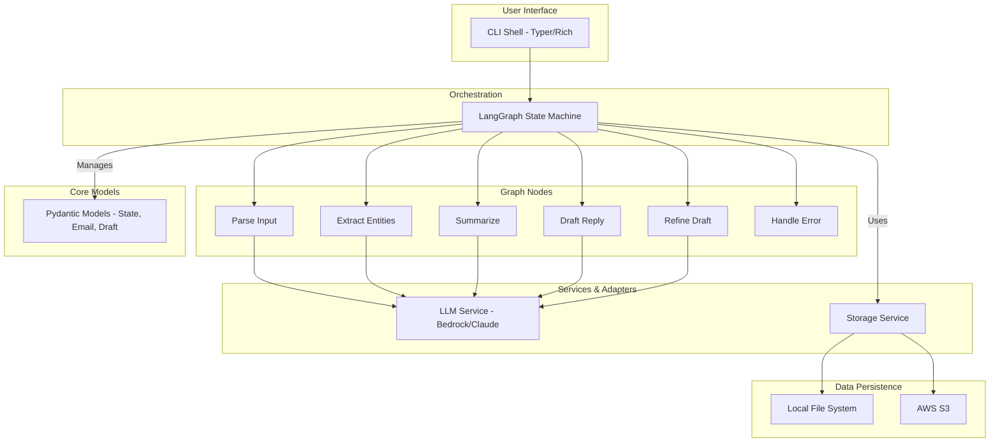
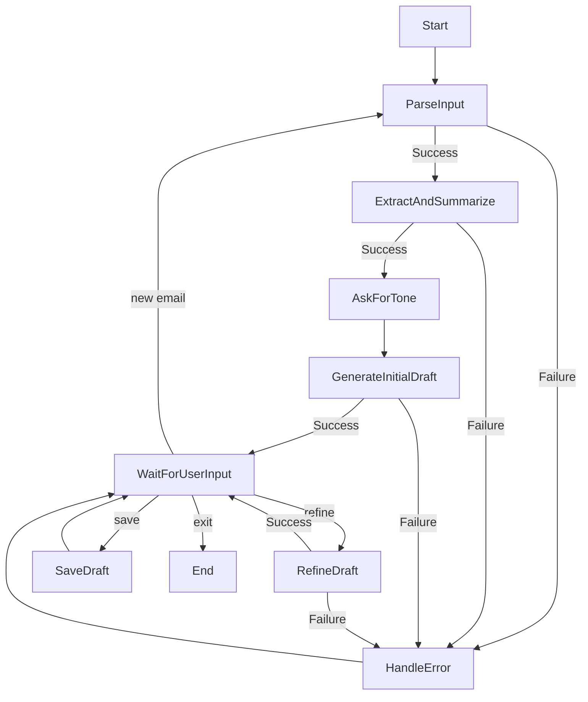

# Architectural Plan: Conversational Email Assistant (CLI)

This document outlines the architecture and development plan for the Conversational Email Assistant, based on the project one-pager.

## 1. Component & Module Map

The system is designed with a layered architecture to separate concerns, making it easier to maintain, test, and extend.



### Responsibilities:

-   **CLI Shell (Typer/Rich):** The entry point for the user. Responsible for capturing user input, displaying conversational history, and rendering styled output. It interacts directly with the Orchestration layer.
-   **Orchestration (LangGraph):** The "brain" of the application. It manages the conversational state, calls the appropriate nodes based on user input and current state, and routes the flow of logic.
-   **Core Logic / Nodes:** Individual, atomic units of work. Each node performs a specific task (e.g., calling the LLM to summarize, extracting entities). They are stateless and receive all necessary data from the graph.
-   **Services & Adapters:** Connectors to external systems. The `LLM Service` abstracts the specifics of calling the AWS Bedrock API. The `Storage Service` provides a unified interface for saving drafts to different backends (`Local`, `S3`).
-   **Data Persistence:** The concrete storage implementations.
-   **Core Models (Pydantic):** Defines the data structures used throughout the application, primarily the graph's state. This ensures data consistency and validation.

---

## 2. LangGraph Node & Edge Specification

The conversational flow is modeled as a state machine.

**State Definition (`GraphState`):**

-   `original_email`: The raw input email text.
-   `email_path`: Optional path to the input file (e.g., PDF).
-   `key_info`: A structured object with sender name, sender contact details, receiver name, receiver contact details, subject.
-   `summary`: A concise summary of the email.
-   `draft_history`: A list of generated drafts, including the current one.
-   `current_tone`: The active tone for drafting (e.g., 'professional').
-   `user_feedback`: The latest input from the user for refinement.
-   `error_message`: A description of the last error, if any.
-   `session_id`: A unique identifier for the conversation.

**Nodes:**

| Node                 | Input (from State)                               | Output (to State)                                     | Description                                                                 |
| -------------------- | ------------------------------------------------ | ----------------------------------------------------- | --------------------------------------------------------------------------- |
| `parse_input`        | `original_email`, `email_path`                   | `original_email` (if from PDF)                        | Reads input text or extracts text from a PDF file.                          |
| `extract_and_summarize` | `original_email`                                 | `key_info`, `summary`                       | Calls the LLM to perform entity extraction and summarization in one step.   |
| `ask_for_tone`         | `summary`, `key_info`                            | `current_tone`                                        | Asks the user to specify a tone for the draft. Defaults if none provided.   |
| `generate_initial_draft` | `key_info`, `summary`, `current_tone`            | `draft_history` (appends new draft)                   | Creates the first reply draft based on the extracted context and tone.      |
| `refine_draft`       | `draft_history` (last draft), `user_feedback`    | `draft_history` (appends refined draft)               | Takes user feedback to modify the latest draft (e.g., change tone, content). |
| `save_draft`         | `draft_history` (last draft)                     | -                                                     | Saves the final draft to the local filesystem or S3.                        |
| `handle_error`       | `error_message`                                  | -                                                     | Informs the user about an error and provides guidance.                      |

**Edges (Transitions):**



---

## 3. Proposed Folder Structure

```
.
├── .gitignore
├── config/
│   └── default.yaml      # Default configuration
├── docs/
│   └── Architectural_Plan.md
├── eassistant/
│   ├── __init__.py
│   ├── cli.py            # Typer/Click app entrypoint & TUI logic
│   ├── config.py         # Configuration loading
│   ├── models.py         # Pydantic models for state and data
│   ├── graph/
│   │   ├── __init__.py
│   │   ├── builder.py    # Compiles the LangGraph graph
│   │   ├── nodes.py      # Node implementations
│   │   └── state.py      # GraphState definition
│   ├── services/
│   │   ├── __init__.py
│   │   ├── llm.py        # AWS Bedrock client wrapper
│   │   └── storage.py    # Storage service (local, S3)
│   └── utils/
│       ├── __init__.py
│       └── files.py      # PDF parsing and file helpers
├── pyproject.toml
├── shell.py              # Main entrypoint script
└── tests/
    ├── __init__.py
    ├── fixtures/
    └── ...               # Mirrored structure for tests
```

---

## 4. Risk List & Mitigations

| Risk                                    | Likelihood | Impact | Mitigation Strategy                                                                                                                            |
| --------------------------------------- | ---------- | ------ | ---------------------------------------------------------------------------------------------------------------------------------------------- |
| **Inaccurate LLM Extraction/Drafting**  | Medium     | High   | - **Prompt Engineering:** Develop robust system prompts and few-shot examples. <br>- **User Correction:** Allow users to edit extracted facts or drafts. <br>- **Iterative Refinement:** The core loop allows users to fix issues. |
| **Handling Diverse/Complex PDF Layouts**| Medium     | Medium | - **Robust Libraries:** Use `PyPDF2` or `pdfminer.six`. <br>- **Graceful Fallback:** If PDF parsing fails, instruct the user to copy/paste the text directly. |
| **Meeting p95 Latency Target (<3s)**    | Low        | Medium | - **Model Selection:** Use a faster model like Claude 3 Haiku for intermediate steps. <br>- **Streaming:** Stream LLM responses to the TUI to improve perceived performance. |
| **AWS Credentials & Security**          | Low        | High   | - **Standard Practices:** Use the standard `boto3` credential chain (env vars, IAM roles). <br>- **Clear Documentation:** Provide clear instructions for users on setting up credentials securely. |
| **Data Privacy (PII in logs)**          | High       | High   | - **Default Off:** Disable logging of raw email content by default. <br>- **Masked Telemetry:** Implement optional, opt-in telemetry that masks PII before sending. |

---

## 5. Milestone Plan

| Milestone | Name              | Key Outcomes & Acceptance Criteria                                                                                                                                                           |
| --------- | ----------------- | -------------------------------------------------------------------------------------------------------------------------------------------------------------------------------------------- |
| **M0**    | **Bootstrap**     | - Project structure, dependencies (`pyproject.toml`), and git repo are set up. <br>- Basic CLI shell runs and accepts input. <br>- A "hello world" LangGraph instance is integrated and runs. |
| **M1**    | **Core Pipeline** | - End-to-end flow for **plain text** works: paste email -> extract entities -> summarize -> get first draft. <br>- Extracted fields are displayed to the user. <br>- No refinement or saving yet. |
| **M2**    | **Features & UX** | - **PDF Parsing:** User can provide a file path. <br>- **Iterative Refinement:** User can request changes to the draft (e.g., tone). <br>- **Session History:** Multiple emails can be processed in one session. |
| **M3**    | **Polish & Ship** | - **Storage:** Drafts can be saved to a local file. Optional S3 upload is implemented. <br>- **Error Handling:** The app handles LLM errors, file errors, etc., gracefully. <br>- **Testing:** Unit and integration test coverage is >80%. |

---

## 6. Testing Strategy

This project adopts a pragmatic, hybrid testing strategy that balances rapid prototyping with long-term robustness. It is not a strict Test-Driven Development (TDD) approach; instead, it builds a safety net of tests incrementally.

-   **Unit Tests for Deterministic Logic:** Core utilities and services with predictable outcomes (e.g., `eassistant/utils/files.py`, `eassistant/services/storage.py`) should be developed with accompanying unit tests from the outset.
-   **Milestone-Based Integration Tests:** At the conclusion of each major feature milestone (M1, M2), a baseline integration test will be added. These tests will run the full graph for that milestone's functionality, using a mocked LLM service. This ensures the core logic and data flow are correct and protects against regressions as new features are added.
-   **Comprehensive Coverage in Polish Phase:** Milestone 3 is dedicated to hardening the application. During this phase, comprehensive unit tests will be written for all remaining business logic (nodes, complex services), and the integration test suite will be expanded to cover edge cases and error conditions. The final goal is to achieve >80% test coverage.

This approach allows for flexibility during the initial, more experimental phases of development while ensuring a high-quality, well-tested application upon completion.

---

## 7. Hierarchical TODO List (Preview)

The final output will be a `project.todo.json` file. Here is a conceptual preview of its structure.

```json
{
  "id": "T0",
  "name": "Conversational Email Assistant MVP",
  "description": "Top-level project epic.",
  "tasks": [
    {
      "id": "M0",
      "name": "Milestone 0: Bootstrap",
      "tasks": [
        {"id": "M0.1", "name": "Setup project structure", "dependencies": []},
        {"id": "M0.2", "name": "Initialize Typer CLI", "dependencies": ["M0.1"]},
        {"id": "M0.3", "name": "Integrate basic LangGraph", "dependencies": ["M0.1"]}
      ]
    },
    {
      "id": "M1",
      "name": "Milestone 1: Core Pipeline",
      "dependencies": ["M0"],
      "tasks": [
        {"id": "M1.1", "name": "Implement 'parse_input' node for text", "dependencies": []},
        {"id": "M1.2", "name": "Implement 'extract_and_summarize' node", "dependencies": []},
        {"id": "M1.3", "name": "Implement 'generate_initial_draft' node", "dependencies": []}
      ]
    }
  ]
}
```

This structured plan should provide a solid foundation for the project.

---

## 8. Detailed Project TODO List (JSON)

This section contains the hierarchical task breakdown in a JSON format. This can be saved as `project.todo.json` during the implementation phase.

```json
{
  "id": "T0",
  "name": "Conversational Email Assistant MVP",
  "description": "Top-level project epic. This file tracks all tasks required to deliver the MVP.",
  "definition_of_done": "All M0-M3 milestones are complete and their respective acceptance criteria are met.",
  "tasks": [
    {
      "id": "M0",
      "name": "Milestone 0: Bootstrap",
      "dependencies": [],
      "definition_of_done": "Project structure is in place, dependencies are defined, and a basic CLI shell with a 'hello world' graph can be executed.",
      "tasks": [
        {
          "id": "M0.1",
          "name": "Set up folder structure and git repository",
          "dependencies": [],
          "definition_of_done": "The folder structure as defined in the architectural plan exists and is checked into a git repository with a .gitignore file."
        },
        {
          "id": "M0.2",
          "name": "Define project dependencies in pyproject.toml",
          "dependencies": ["M0.1"],
          "definition_of_done": "pyproject.toml contains all necessary libraries (langgraph, pydantic, typer, rich, boto3, etc.)."
        },
        {
          "id": "M0.3",
          "name": "Implement basic Typer CLI shell",
          "dependencies": ["M0.1"],
          "definition_of_done": "A `shell.py` entry point exists that can be run to start an interactive loop that accepts user input."
        },
        {
          "id": "M0.4",
          "name": "Create 'hello world' LangGraph instance",
          "dependencies": ["M0.1"],
          "definition_of_done": "A simple graph with a start and end node is defined and can be invoked."
        },
        {
          "id": "M0.5",
          "name": "Integrate graph into CLI shell",
          "dependencies": ["M0.3", "M0.4"],
          "definition_of_done": "User input in the CLI is passed to the LangGraph instance and the result is printed to the console."
        }
      ]
    },
    {
      "id": "M1",
      "name": "Milestone 1: Core Pipeline (Text)",
      "dependencies": ["M0"],
      "definition_of_done": "The full pipeline from pasting plain text to generating a first draft is functional.",
      "tasks": [
        {
          "id": "M1.1",
          "name": "Define Pydantic models for GraphState",
          "dependencies": [],
          "definition_of_done": "The core `GraphState` class is defined in `eassistant/graph/state.py` with all required fields."
        },
        {
          "id": "M1.2",
          "name": "Implement `parse_input` node for plain text",
          "dependencies": ["M1.1"],
          "definition_of_done": "The node correctly takes user input and populates the `original_email` field in the state."
        },
        {
          "id": "M1.3",
          "name": "Implement LLM service for Bedrock Claude",
          "dependencies": [],
          "definition_of_done": "A service class in `eassistant/services/llm.py` can invoke a Claude model on Bedrock and return the response."
        },
        {
          "id": "M1.4",
          "name": "Implement `extract_and_summarize` node",
          "dependencies": ["M1.1", "M1.3"],
          "definition_of_done": "The node calls the LLM service and populates the `key_info` and `summary` fields in the state."
        },
        {
          "id": "M1.5",
          "name": "Implement `generate_initial_draft` node",
          "dependencies": ["M1.1", "M1.3", "M1.4"],
          "definition_of_done": "The node uses the summary and entities to generate a draft and adds it to the `draft_history` in the state."
        },
        {
          "id": "M1.6",
          "name": "Build the core pipeline graph",
          "dependencies": ["M1.2", "M1.4", "M1.5"],
          "definition_of_done": "The nodes are connected in `eassistant/graph/builder.py` to form the complete text-to-draft pipeline."
        }
      ]
    },
    {
      "id": "M2",
      "name": "Milestone 2: Features & UX",
      "dependencies": ["M1"],
      "definition_of_done": "PDF parsing, draft refinement, and multi-turn conversation are all functional.",
      "tasks": [
        {
          "id": "M2.1",
          "name": "Implement PDF parsing utility",
          "dependencies": [],
          "definition_of_done": "A function in `eassistant/utils/files.py` can extract text from a PDF file path."
        },
        {
          "id": "M2.2",
          "name": "Enhance `parse_input` node to handle file paths",
          "dependencies": ["M1.2", "M2.1"],
          "definition_of_done": "The node can differentiate between raw text and a file path, using the PDF utility when needed."
        },
        {
          "id": "M2.3",
          "name": "Implement `refine_draft` node",
          "dependencies": ["M1.1", "M1.3"],
          "definition_of_done": "The node takes `user_feedback` and the latest draft to generate a new version."
        },
        {
          "id": "M2.4",
          "name": "Add conditional logic for refinement in the graph",
          "dependencies": ["M1.6", "M2.3"],
          "definition_of_done": "The graph can now route user input to the `refine_draft` node or start a new email."
        },
        {
          "id": "M2.5",
          "name": "Manage session history",
          "dependencies": ["M1.1"],
          "definition_of_done": "The state correctly handles multiple emails within a single run of the CLI application."
        }
      ]
    },
    {
      "id": "M3",
      "name": "Milestone 3: Polish & Ship",
      "dependencies": ["M2"],
      "definition_of_done": "The application is robust, with proper storage, error handling, and sufficient test coverage.",
      "tasks": [
        {
          "id": "M3.1",
          "name": "Implement Storage service (local file)",
          "dependencies": [],
          "definition_of_done": "A service in `eassistant/services/storage.py` can save a string to a local file."
        },
        {
          "id": "M3.2",
          "name": "Implement Storage service (S3)",
          "dependencies": ["M3.1"],
          "definition_of_done": "The storage service can optionally upload a file to a user-provided S3 bucket."
        },
        {
          "id": "M3.3",
          "name": "Implement `save_draft` node",
          "dependencies": ["M1.1", "M3.1"],
          "definition_of_done": "A node is created that uses the storage service to save the latest draft."
        },
        {
          "id": "M3.4",
          "name": "Implement `handle_error` node and graph integration",
          "dependencies": ["M1.6"],
          "definition_of_done": "The graph can catch exceptions from any node and route to a node that prints a user-friendly error message."
        },
        {
          "id": "M3.5",
          "name": "Write unit tests for nodes and services",
          "dependencies": [],
          "definition_of_done": "Key business logic in nodes and services has corresponding pytest tests."
        },
        {
          "id": "M3.6",
          "name": "Write integration tests for the graph",
          "dependencies": ["M1.6", "M2.4"],
          "definition_of_done": "Tests exist that run the entire graph with mock data to verify end-to-end logic."
        },
        {
          "id": "M3.7",
          "name": "Achieve >80% test coverage",
          "dependencies": ["M3.5", "M3.6"],
          "definition_of_done": "`pytest --cov` reports coverage of 80% or higher."
        }
      ]
    }
  ]
}
```

---

## 9. Development Workflow: The TaskCycle

The development of this project is intended to be assisted by an automated agent referred to as the "TaskCycle". This agent automates the process of picking a task from `project.todo.json`, implementing the necessary code changes, and preparing the result for commit.

### Assisted Commit Workflow

To balance automation with essential developer oversight, the TaskCycle uses an "assisted commit" workflow. This ensures that no code is committed without final human approval.

The workflow is as follows:

1.  **Task Execution & Verification**: Upon completing the coding for a task, the TaskCycle runs all automated checks (tests, linters, etc.).
2.  **Staging Changes**: If all checks pass, the TaskCycle stages the modified files using `git add`.
3.  **Commit Message Generation**: A commit message is automatically generated. **The message MUST be a one-liner that includes the ID(s) of the completed task(s)**. For example: `feat: Implement 'parse_input' node (M1.2)`.
4.  **Developer Approval**: The staged changes and the generated commit message are presented to the developer. The developer performs a final review, makes any necessary adjustments, and executes the `git commit` command.

This process streamlines development while ensuring the quality and integrity of the project's version history.