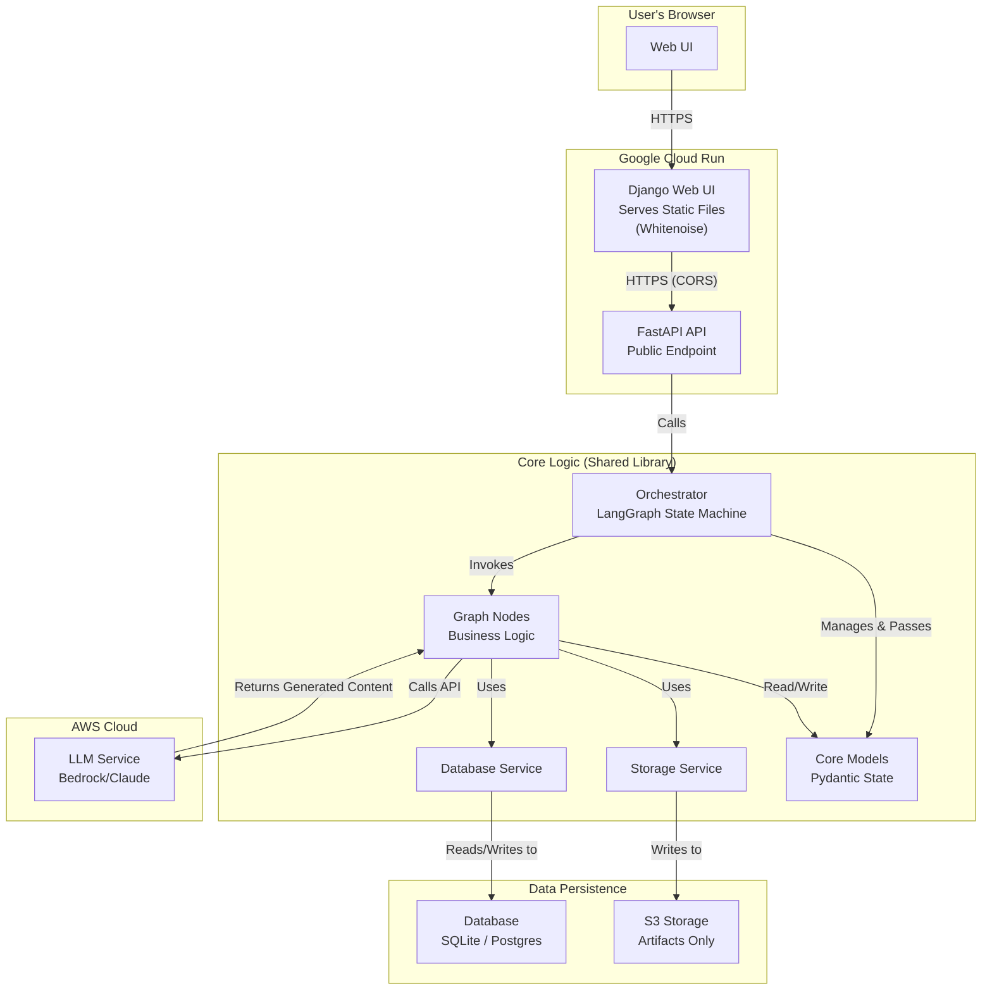

# Architectural Plan: Conversational Email Assistant

This document outlines the architecture and development plan for the Conversational Email Assistant, based on the project one-pager.

## 1. Rationale for Architectural Refactor

This plan incorporates a significant architectural refactor aimed at aligning the system with modern, scalable chatbot design patterns. The primary motivation is to introduce a persistent, structured data layer to manage conversational state, ensuring session continuity and providing a foundation for future features like analytics and multi-user support.

For a detailed gap analysis and justification, see the [Chatbot Architecture Refactor Summary](docs/Chatbot_Architecture_Refactor_Summary.md).

---

## 2. Component & Module Map

The system is designed with a service-oriented architecture to separate concerns, making it easier to maintain, test, and extend. The introduction of a database is a key change to the original architecture.



### Responsibilities:

-   **Web UI (Django/Whitenoise):** The entry point for the user. Responsible for rendering the user interface, serving static assets, and handling user interactions. It communicates with the FastAPI API to perform actions.
-   **API Service (FastAPI):** Provides a public HTTP endpoint that wraps the core LangGraph orchestrator. It is responsible for request handling, validation, and security (including CORS). **Crucially, it will now load and save conversational state from the database for each request.**
-   **Orchestration (LangGraph):** The "brain" of the application. It manages the conversational state for a single turn. It is a **stateless orchestrator** that receives state at the beginning of a request and returns the updated state at the end.
-   **Core Logic / Nodes:** Individual, atomic units of work. Each node performs a specific task. They remain stateless and receive all necessary data from the graph.
-   **Services & Adapters:**
    -   `LLM Service`: Abstracts the specifics of calling the AWS Bedrock API.
    -   `Storage Service`: Provides a unified interface for saving artifacts (e.g., drafts, files) to `S3`.
    -   `Database Service`: A new service responsible for all database interactions, including managing users, sessions, messages, and graph state.
-   **Data Persistence:**
    -   **Database (SQLite/Postgres):** The primary source of truth for structured data, including `users`, `sessions`, `messages`, and the serialized `graph_state`.
    -   **S3 Storage:** Used exclusively for storing large binary artifacts referenced by the database.
-   **Core Models (Pydantic):** Defines the data structures used throughout the application, primarily the graph's state. This ensures data consistency and validation.

---

## 3. LangGraph Node & Edge Specification

The conversational flow remains modeled as a state machine. The `GraphState` definition is largely unchanged but will be persisted to the database between turns.

**State Definition (`GraphState`):**

-   `session_id`: A unique identifier for the conversation.
-   `user_input`: The raw text input from the user in the current turn.
-   `intent`: The classified intent of the user (e.g., `new_email`, `refine_draft`).
-   `original_email`: The raw input email text.
-   `email_path`: Optional path to the input file (e.g., PDF).
-   `key_info`: A structured object with sender name, sender contact details, receiver name, receiver contact details, subject.
-   `summary`: A concise summary of the email.
-   `draft_history`: A list of generated drafts, including the current one.
-   `current_tone`: The active tone for drafting (e.g., 'professional').
-   `user_feedback`: The latest input from the user for refinement.
-   `error_message`: A description of the last error, if any.
-   `conversation_summary`: A running summary of the conversation for context-aware routing.

**(The Node and Edge specifications remain the same as the original plan but will be enhanced by the modular routing recommendations in the development plan.)**

---

## 4. Folder Structure

The folder structure will be updated to include the new database service and models.

```
.
├── ...
├── src/
│   └── eassistant/
│       ├── __init__.py
│       ├── config.py
│       ├── models.py
│       ├── db.py  # New database service
│       ├── graph/
│       │   ├── ...
│       ├── services/
│       │   ├── ...
│       └── utils/
│           └── ...
└── tests/
    └── ...
```

---

## 5. Development Plan

The development will be executed in three distinct phases to manage complexity and deliver value incrementally. The `project.todo.json` file will be updated to reflect these phases and their associated tasks.

### Phase 1: Database Integration & State Persistence

The goal of this phase is to establish the core database layer and ensure that conversational state is persisted between requests.

1.  **Introduce a Database Service:**
    -   Create a `DatabaseService` module responsible for all database interactions.
    -   Use SQLAlchemy Core for schema definition and queries.
    -   Define tables for `users`, `sessions`, `graph_state`, and `messages`.
    -   Implement with SQLite for local development and testing.

2.  **Integrate State Management into API:**
    -   Modify the FastAPI endpoint to:
        -   On request: Load or create a session.
        -   Retrieve the latest `graph_state` from the database.
        -   Execute the LangGraph orchestrator with the loaded state.
        -   On response: Save the updated `graph_state` and any new messages to the database.

3.  **Establish Basic User/Session Handling:**
    -   Implement a mechanism to identify a user (e.g., from a header) and associate them with a session.

### Phase 2: Refine S3 Usage & Repository Patterns

This phase focuses on tightening the separation of concerns between the database and S3, ensuring that S3 is used only for its intended purpose: artifact storage.

1.  **Create Artifact Repository:**
    -   Refactor the `StorageService` to be an `ArtifactRepository`.
    -   Ensure all file-based operations (e.g., saving drafts) use this repository.

2.  **Link Artifacts to Database:**
    -   Create a new table (e.g., `artifacts`) to store metadata about files in S3 (e.g., path, type, session_id).
    -   When a draft is saved, the repository will write the file to S3 and create a corresponding entry in the `artifacts` table.

### Phase 3: Optional Enhancements (Summaries & RAG)

With the core persistence layer in place, this phase focuses on adding value-add features that leverage the new architecture.

1.  **Implement Conversation Summarization:**
    -   Add a `summary` field to the `sessions` table.
    -   Create a background task or a conditional graph node that periodically summarizes the conversation history to keep the context provided to the LLM concise and efficient.

2.  **Introduce a Retrieval-Augmented Generation (RAG) Layer:**
    -   (Future) Explore adding a vector database to enable retrieval of information from past conversations or external documents.

---

## 6. Risk List & Mitigations

(Risks from the original plan remain relevant and are augmented by the following:)

| Risk | Likelihood | Impact | Mitigation Strategy & Status |
| --- | --- | --- | --- |
| **Database Schema Complexity** | Medium | Medium | **[To Be Mitigated]** <br>- Start with a minimal, normalized schema. <br>- Use an ORM or query builder like SQLAlchemy to manage migrations and abstract queries. |
| **Data Migration** | Low | High | **[To Be Mitigated]** <br>- Design the schema to be extensible. <br>- Use a migration tool (e.g., Alembic) from the start, even with SQLite. |

---

## 7. Testing Strategy

The testing strategy is updated to include the data layer:

-   **Unit Tests:** Continue for deterministic logic. Add tests for the `DatabaseService` using an in-memory SQLite database.
-   **Integration Tests:** Update feature-based integration tests to run against a test database. Tests will now involve setting up initial state in the database, running the graph, and asserting that the final state in the database is correct.
-   **Comprehensive Coverage:** The goal of >80% coverage remains.

---

## 8. Technology Rationale

(The rationale for LangGraph, AWS Bedrock, Typer, and Pydantic remains the same. The following is added:)

*   **SQLite / PostgreSQL (for Data Persistence):**
    *   **Why:** A relational database is essential for storing structured, relational data like users, sessions, and messages.
    *   **Alternatives Considered:** Storing state in S3 as JSON files.
    *   **Reason for Choice:** A proper database provides transactional integrity, queryability, and performance that a file-based approach on S3 cannot match. SQLite is chosen for its simplicity in local development, while PostgreSQL offers a robust, production-ready path for deployment. This dual approach minimizes setup friction while ensuring a clear path to production.

---

## 9. Architecture Decision Records (ADRs)

Significant architectural decisions are documented as ADRs in the [`docs/adr`](docs/adr) directory. This creates a historical log of key technical choices and their rationale.