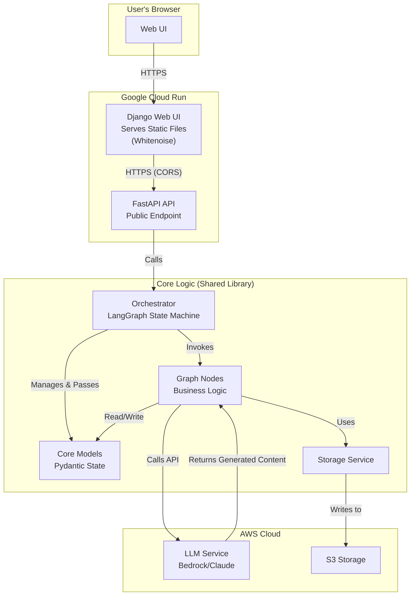
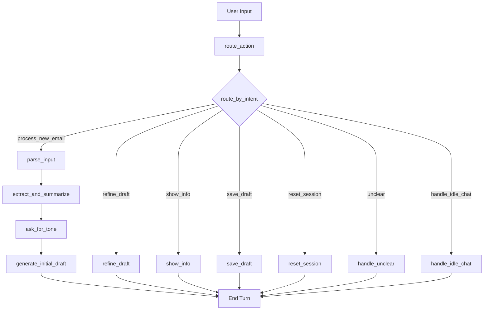

# Architectural Plan: Conversational Email Assistant

This document outlines the architecture and development plan for the Conversational Email Assistant, based on the project one-pager.

## 1. Component & Module Map

The system is designed with a service-oriented architecture to separate concerns, making it easier to maintain, test, and extend.



### Responsibilities:

-   **Web UI (Django/Whitenoise):** The entry point for the user. Responsible for rendering the user interface, serving static assets, and handling user interactions. It communicates with the FastAPI API to perform actions.
-   **API Service (FastAPI):** Provides a public HTTP endpoint that wraps the core LangGraph orchestrator. It is responsible for request handling, validation, and security (including CORS).
-   **Orchestration (LangGraph):** The "brain" of the application. It manages the conversational state, calls the appropriate nodes based on user input and current state, and routes the flow of logic.
-   **Core Logic / Nodes:** Individual, atomic units of work. Each node performs a specific task (e.g., calling the LLM to summarize, extracting entities). They are stateless and receive all necessary data from the graph.
-   **Services & Adapters:** Connectors to external systems. The `LLM Service` abstracts the specifics of calling the AWS Bedrock API. The `Storage Service` provides a unified interface for saving drafts to different backends (`Local`, `S3`).
-   **Data Persistence:** The concrete storage implementations.
-   **Core Models (Pydantic):** Defines the data structures used throughout the application, primarily the graph's state. This ensures data consistency and validation.

---

## 2. LangGraph Node & Edge Specification

The conversational flow is modeled as a state machine.

**State Definition (`GraphState`):**

-   `session_id`: A unique identifier for the conversation.
-   `user_input`: The raw text input from the user in the current turn.
-   `intent`: The classified intent of the user (e.g., `new_email`, `refine_draft`).
-   `original_email`: The raw input email text.
-   `email_path`: Optional path to the input file (e.g., PDF).
-   `key_info`: A structured object with sender name, sender contact details, receiver name, receiver contact details, subject.
-   `summary`: A concise summary of the email.
-   `draft_history`: A list of generated drafts, including the current one.
-   `current_tone`: The active tone for drafting (e.g., 'professional').
-   `user_feedback`: The latest input from the user for refinement.
-   `error_message`: A description of the last error, if any.
-   `conversation_summary`: A running summary of the conversation for context-aware routing.

**Nodes:**

| Node | Input (from State) | Output (to State) | Description |
| --- | --- | --- | --- |
| `route_action` | `user_input`, `draft_history`, `conversation_summary` | `intent`, `original_email`, `user_feedback` | **Entry Point**. Uses a **context-aware** LLM prompt, enriched with conversation summary and state, to classify the user's intent. It is responsible for interpreting natural language commands, such as instructions to load a file (e.g., "load example.pdf"). |
| `handle_idle_chat` | - | - | Responds to conversational filler without triggering the main workflow. |
| `parse_input` | `original_email` | `original_email` (if from PDF) | Reads input text or extracts text from a PDF file. |
| `extract_and_summarize` | `original_email` | `key_info`, `summary` | Calls the LLM to perform entity extraction and summarization. |
| `ask_for_tone` | `summary`, `key_info` | `current_tone` | Asks the user to specify a tone for the draft. |
| `generate_initial_draft` | `key_info`, `summary`, `current_tone` | `draft_history` (appends new draft) | Creates the first reply draft. |
| `refine_draft` | `draft_history`, `user_feedback` | `draft_history` (appends refined draft) | Takes user feedback to modify the latest draft. |
| `show_info` | `key_info`, `summary` | - | Displays the extracted information to the user. |
| `save_draft` | `draft_history` | - | Saves the final draft to the local filesystem or S3. |
| `reset_session` | `session_id` | (resets all other fields) | Clears the state to start a new conversation. |
| `handle_unclear` | - | - | Informs the user that their intent was not understood. |
| `handle_error` | `error_message` | - | Informs the user about an error. |

**Edges (Transitions):**

The graph is driven by a state-aware, conversational routing node that directs the flow based on the current context.



---

## 3. Folder Structure

```
.
├── .gitignore
├── config/
│   └── default.yaml
├── docs/
│   ├── Architectural_Plan.md
│   ├── guardrails.md
│   └── adr/
│       └── ...
├── project.todo.json
├── pyproject.toml
├── README.md
├── services/
│   ├── api/
│   │   ├── Dockerfile
│   │   ├── main.py
│   │   └── requirements.txt
│   └── ui/
│       ├── Dockerfile
│       ├── manage.py
│       └── requirements.txt
├── src/
│   └── eassistant/
│       ├── __init__.py
│       ├── config.py
│       ├── models.py
│       ├── graph/
│       │   ├── __init__.py
│       │   ├── builder.py
│       │   ├── nodes.py
│       │   └── state.py
│       ├── services/
│       │   ├── __init__.py
│       │   ├── llm.py
│       │   └── storage.py
│       └── utils/
│           ├── __init__.py
│           └── files.py
└── tests/
    ├── __init__.py
    ├── fixtures/
    └── ...
```

---

## 4. Risk List & Mitigations

| Risk                                    | Likelihood | Impact | Mitigation Strategy & Status                                                                                                                            |
| --------------------------------------- | ---------- | ------ | ---------------------------------------------------------------------------------------------------------------------------------------------- |
| **Inaccurate LLM Extraction/Drafting**  | Medium     | High   | **[Implemented]** <br>- **Prompt Engineering:** Develop robust system prompts and few-shot examples. <br>- **User Correction:** Allow users to edit extracted facts or drafts. <br>- **Iterative Refinement:** The core loop allows users to fix issues. |
| **Handling Diverse/Complex PDF Layouts**| Medium     | Medium | **[Implemented]** <br>- **Robust Libraries:** Use `PyPDF2` or `pdfminer.six`. <br>- **Graceful Fallback:** If PDF parsing fails, instruct the user to copy/paste the text directly. |
| **Meeting p95 Latency Target (<3s)**    | Low        | Medium | **[Potential / Not Implemented]** <br>- **Model Selection:** Use a faster model like Claude 3 Haiku for intermediate steps. <br>- **Streaming:** Stream LLM responses to the TUI to improve perceived performance. |
| **AWS Credentials & Security**          | Low        | High   | **[Implemented]** <br>- **Standard Practices:** Use the standard `boto3` credential chain (env vars, IAM roles). <br>- **Clear Documentation:** Provide clear instructions for users on setting up credentials securely. |
| **Data Privacy (PII in logs)**          | High       | High   | **[Implemented]** <br>- **Default Off:** Disable logging of raw email content by default. <br>**[Potential / Not Implemented]** <br>- **Masked Telemetry:** Implement optional, opt-in telemetry that masks PII before sending. |

---

## 5. Development Plan

The development roadmap and task-level details are managed in the `project.todo.json` file. This file serves as the single source of truth for the project's status, upcoming features, and definition of done for each task, adhering to the project's task-driven development process.

---

## 6. Testing Strategy

This project adopts a pragmatic, hybrid testing strategy that balances rapid prototyping with long-term robustness. It is not a strict Test-Driven Development (TDD) approach; instead, it builds a safety net of tests incrementally.

-   **Unit Tests for Deterministic Logic:** Core utilities and services with predictable outcomes (e.g., `eassistant/utils/files.py`, `eassistant/services/storage.py`) should be developed with accompanying unit tests from the outset.
-   **Feature-Based Integration Tests:** Upon the completion of major features or epics, a baseline integration test will be added. These tests will run the full graph for that feature's functionality, using a mocked LLM service. This ensures the core logic and data flow are correct and protects against regressions as new features are added.
-   **Comprehensive Coverage During Hardening:** Before shipping major releases, a dedicated hardening phase will focus on writing comprehensive unit tests for all remaining business logic (nodes, complex services) and expanding the integration test suite to cover edge cases and error conditions. The final goal is to achieve >80% test coverage.

This approach allows for flexibility during the initial, more experimental phases of development while ensuring a high-quality, well-tested application upon completion.

---


## 7. Technology Rationale

The technology stack for this project was chosen to prioritize rapid development, leverage managed services for complex AI tasks, and maintain a clean, testable architecture.

*   **LangGraph (for Orchestration):**
    *   **Why:** LangGraph provides a robust framework for building stateful, multi-actor applications with LLMs. Its graph-based paradigm is a natural fit for modeling conversational flows, which are inherently cyclical and state-dependent.
    *   **Alternatives Considered:** Hard-coded string pattern matching for intent classification.
    *   **Reason for Choice:** While a simple keyword-based router would be fast to implement, it would be brittle and difficult to extend to more nuanced conversational commands. LangGraph provides a much more flexible and robust solution. Its graph structure makes the application logic explicit and easy to follow, and adding new capabilities (nodes) or changing conversational flows (edges) is significantly cleaner than managing a complex web of `if/else` statements or regex patterns. This improves long-term maintainability.

*   **AWS Bedrock (for LLM Access):**
    *   **Why:** Bedrock provides a managed, serverless API for accessing high-performing foundation models like Anthropic's Claude.
    *   **Alternatives Considered:** Directly using the Anthropic API or other cloud providers' LLM services.
    *   **Reason for Choice:** Bedrock simplifies infrastructure management, security, and credentialing. By using the standard `boto3` SDK, the application can leverage the existing AWS ecosystem for authentication (e.g., IAM roles), which is more secure and enterprise-ready than managing separate API keys. It also provides a single endpoint for potentially switching between different models in the future with minimal code changes.

*   **Typer (for CLI):**
    *   **Why:** Typer is a modern, easy-to-use library for building command-line interfaces.
    *   **Alternatives Considered:** `argparse`, `Click`.
    *   **Reason for Choice:** Typer is built on top of Click but provides a more intuitive, Pydantic-style interface using Python type hints. This reduces boilerplate code and makes the CLI logic cleaner and easier to read.

*   **Pydantic (for Data Modeling):**
    *   **Why:** Pydantic is used for data validation and settings management.
    *   **Reason for Choice:** It enforces data consistency throughout the application, especially for the `GraphState`. This prevents runtime errors and makes the data flow explicit and predictable. Its integration with Typer is an added bonus.

---

## 8. Architecture Decision Records (ADRs)

Significant architectural decisions are documented as ADRs in the [`docs/adr`](docs/adr) directory. This creates a historical log of key technical choices and their rationale.