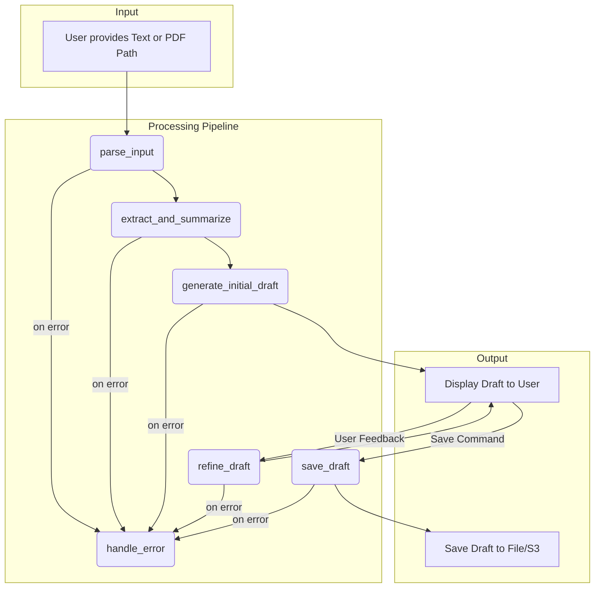

# Project Status Summary

### Project Status: MVP Complete

All planned tasks for the Minimum Viable Product (MVP), from initial bootstrapping to final polishing, have been completed. The project is now a functional command-line application that assists users in drafting emails from raw text or PDF files.

### Key Features Implemented

The project was developed across four major milestones:

*   **M0: Bootstrap:** The foundational project structure, dependencies, and an interactive command-line shell were established.
*   **M1: Core Pipeline (Text):** The core email processing workflow was built. The system can take a block of text, use an LLM to extract key information and a summary, and then generate an initial email draft.
*   **M2: Features & UX:** The application was enhanced with key features, including:
    *   **PDF Parsing:** The ability to process PDF files in addition to plain text.
    *   **Draft Refinement:** Users can provide feedback in a conversational manner to iteratively refine the generated draft.
    *   **Session Management:** The shell maintains a session history, allowing for multi-turn interactions.
*   **M3: Polish & Ship:** The application was made more robust with:
    *   **Storage Options:** Drafts can be saved to a local file or uploaded to an AWS S3 bucket.
    *   **Error Handling:** The processing graph includes a dedicated error-handling node to manage exceptions gracefully.
    *   **Test Coverage:** The codebase has over 80% test coverage, ensuring reliability.

### High-Level Architecture

The application's logic is built around a `langgraph` state machine. User input is processed through a series of nodes that progressively enrich a central `GraphState` object.

Here is a simplified diagram of the core workflow:

### Known Issues

*   **Failing CLI Tests:** There is a persistent issue where the tests for the interactive shell ([`tests/test_cli.py`](tests/test_cli.py)) are failing. The `typer` test runner is not correctly interpreting the application's exit code. While the application itself functions correctly when run manually, these tests are currently unreliable and need to be fixed.

### Next Steps

With the MVP complete, the next steps would typically involve:
1.  Resolving the failing CLI tests.
2.  Beginning work on the next set of features as defined in a new project plan.
3.  Packaging the application for easier distribution.